<div align="center">

# 梵公子-skill

面向中文场景的情感分析与关系处理 skill。

**qclaw 安装请使用仓库根目录的 `SKILL.md`。**



</div>

## 安装

如果你使用 qclaw 或其他支持 skill 仓库导入的工具，直接使用本仓库地址：

```text
https://github.com/lelexiaxia/an-emotion-analysis-skill-main
```

如果工具要求本地安装，把 `SKILL.md` 放到对应的 skills 目录即可。

## 支持场景

- 聊天开场、破冰、冷场补救
- 邀约推进、约饭、被拒后的收线处理
- 兴趣判断、忽冷忽热、礼貌还是有意
- 关系推进、长期关系、止损判断
- 女性类型识别、风险信号识别
- 形象建设、展示面、朋友圈优化

## 回答结构

本 skill 会尽量按以下结构回答：

1. 结论先行
2. 原因分析
3. 具体动作
4. 风险提醒
5. 终局判断：继续、到此为止、撤

## 文件说明

```text
.
├── SKILL.md          # qclaw / skill 工具优先识别的文件
├── public-skill.md   # 兼容旧说明的副本
├── docs/demo.svg     # 演示图
├── LICENSE
└── README.md
```

## 免责声明

本工具仅供个人成长和健康关系建设使用。不提供操纵、胁迫或利用他人的建议。始终尊重各方边界与意愿。
